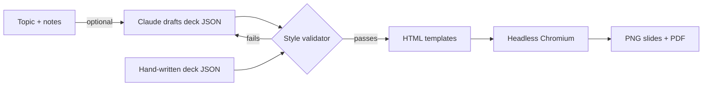

# LinkedIn Carousel Studio

**From outline to a post-ready LinkedIn carousel in one command.**

I post about creator marketing and AI on LinkedIn, and carousels are the format that gets saved and shared most. Designing each one by hand took me an hour or more. This tool takes a short outline, applies one locked visual style, checks the editorial rules, and renders PNG slides plus the PDF that LinkedIn accepts as a document post.


The example above is [`examples/creator-contract-checks.json`](examples/creator-contract-checks.json), rendered to [`examples/output/`](examples/output/).

## Use it

```bash
git clone https://github.com/Vishwajeetkumbhar379/linkedin-carousel-studio
cd linkedin-carousel-studio
pip install -e ".[dev]"
python -m playwright install chromium
carousel render examples/creator-contract-checks.json --out out/
```

Upload `out/<slug>.pdf` to LinkedIn as a document post.

## Write a deck

A deck is a small JSON file. Six slide types cover almost every post:

| Type | For |
|---|---|
| `cover` | The hook, under 10 words |
| `point` | One idea with a label, title and short body |
| `stat` | A big number with context |
| `list` | Up to five numbered items |
| `compare` | Two columns, like "red flag vs fair" |
| `cta` | Save and follow, always last |

Wrap a word in `*asterisks*` to colour it with the accent.

## Style rules, enforced in code

The renderer refuses decks that break the rules a good carousel follows:

- 5 to 12 slides, starting with a cover and ending with a call to action
- A hook under 10 words
- One idea per slide, at most 45 words of body text
- At most five list items
- Emojis used sparingly as visual anchors, not decoration

Every slide shares the same frame: author and handle top-left, a pill counter top-right, tinted cards in purple, teal and coral, hairline borders and a `swipe →` cue. Fonts (Inter and JetBrains Mono, both OFL) are bundled, so slides look identical on any machine.

## Let Claude draft it (optional)

```bash
pip install -e ".[ai]"
export ANTHROPIC_API_KEY=sk-...
carousel draft "What 850 creator deals taught me about briefs" --notes my_notes.txt --name "Your Name" --handle "@you"
carousel render deck.json
```

### Free option: no Anthropic key needed

Without `ANTHROPIC_API_KEY`, `carousel draft` uses every free provider you have a key for, as a fallback chain (best quality first). If one is rate-limited, out of credit, times out, or keeps breaking the style rules, the next one takes over. No extra packages needed.

| Order | Provider | Env var | Default model |
|---|---|---|---|
| 1 | NVIDIA (build.nvidia.com) | `NVIDIA_API_KEY` | `moonshotai/kimi-k3` |
| 2 | GitHub Models | `GITHUB_MODELS_TOKEN` or `GITHUB_API_KEY` | `openai/gpt-4.1` |
| 3 | OpenRouter | `OPENROUTER_API_KEY` | `nvidia/nemotron-3-super-120b-a12b:free` |
| 4 | Groq | `GROQ_API_KEY` | `openai/gpt-oss-120b` |
| 5 | Cloudflare Workers AI | `CLOUDFLARE_API_TOKEN` (+ optional `CLOUDFLARE_ACCOUNT_ID`, looked up from the token if missing) | `@cf/meta/llama-3.3-70b-instruct-fp8-fast` |
| 6 | Z.AI (GLM) | `ZAI_API_KEY` | `glm-4.5-flash` |
| 7 | LLM7 | `LLM7_API_KEY` | `deepseek-v4-pro` |
| 8 | Mistral | `MISTRAL_API_KEY` | `ministral-14b-latest` |
| 9 | SambaNova | `SAMBANOVA_API_KEY` | `gpt-oss-120b` (needs a payment method on file) |

```bash
carousel draft "What 850 creator deals taught me about briefs" --notes my_notes.txt   # auto chain
carousel draft "..." --notes my_notes.txt --provider groq                            # one provider only
CAROUSEL_MODEL=z-ai/glm-5.3 carousel draft "..." --notes my_notes.txt --provider nvidia
```

The CLI prints which provider wrote the draft. Rate limits (HTTP 429) are retried with backoff before moving on.

Claude returns the deck as **structured JSON through tool use**, along with a caption. The same style validator checks the draft, and if it breaks a rule the errors go back to Claude for one more attempt. The prompt forbids statistics that aren't in your notes, and the code enforces it: any percentage or multiplier (`43%`, `2x`) whose number isn't in your notes goes back to the model as an error, so the post stays true to your experience. You always review the JSON before rendering.

## How it works



---

Built by [Vishwajeet Kumbhar](https://www.linkedin.com/in/vishwajeetkumbhar379) with Claude Code. MIT licence.
