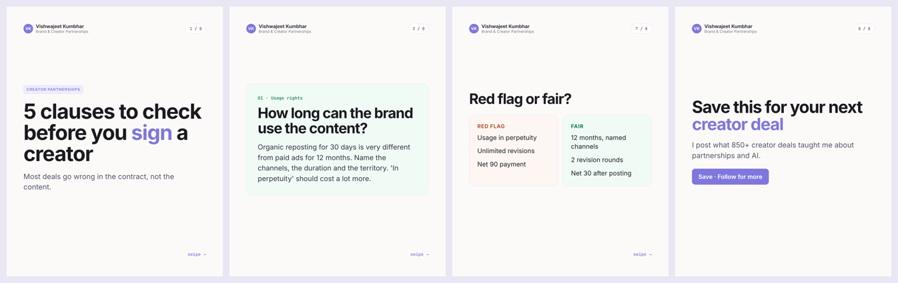
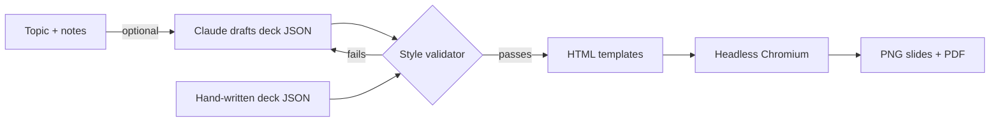

# LinkedIn Carousel Studio

**From outline to a post-ready LinkedIn carousel in one command.**

I post about creator marketing and AI on LinkedIn, and carousels are the format that gets saved and shared most. Designing each one by hand took me an hour or more. This tool takes a short outline, applies one locked visual style, checks the editorial rules, and renders PNG slides plus the PDF that LinkedIn accepts as a document post.



The example above is [`examples/creator-contract-checks.json`](examples/creator-contract-checks.json), rendered to [`examples/output/`](examples/output/).

## Use it

```bash
git clone https://github.com/Vishwajeetkumbhar379/linkedin-carousel-studio
cd linkedin-carousel-studio
pip install -e ".[dev]"
python -m playwright install chromium
carousel render examples/creator-contract-checks.json --out out/
```

Upload `out/<slug>.pdf` to LinkedIn as a document post.

## Write a deck

A deck is a small JSON file. Six slide types cover almost every post:

| Type | For |
|---|---|
| `cover` | The hook, under 10 words |
| `point` | One idea with a label, title and short body |
| `stat` | A big number with context |
| `list` | Up to five numbered items |
| `compare` | Two columns, like "red flag vs fair" |
| `cta` | Save and follow, always last |

Wrap a word in `*asterisks*` to colour it with the accent.

## Style rules, enforced in code

The renderer refuses decks that break the rules a good carousel follows:

- 5 to 12 slides, starting with a cover and ending with a call to action
- A hook under 10 words
- One idea per slide, at most 45 words of body text
- At most five list items
- Emojis used sparingly as visual anchors, not decoration

Every slide shares the same frame: author and handle top-left, a pill counter top-right, tinted cards in purple, teal and coral, hairline borders and a `swipe →` cue. Fonts (Inter and JetBrains Mono, both OFL) are bundled, so slides look identical on any machine.

## Let Claude draft it (optional)

```bash
pip install -e ".[ai]"
export ANTHROPIC_API_KEY=sk-...
carousel draft "What 850 creator deals taught me about briefs" --notes my_notes.txt --name "Your Name" --handle "@you"
carousel render deck.json
```

Claude returns the deck as **structured JSON through tool use**, along with a caption. The same style validator checks the draft, and if it breaks a rule the errors go back to Claude for one more attempt. The prompt forbids statistics that aren't in your notes, so the post stays true to your experience. You always review the JSON before rendering.

## How it works



## Build with Vish content engine (new)

This repo now also holds the content engine that researches, writes, designs, renders and checks Vish's LinkedIn posts. It is in a **test-first** phase: three sample directions are in `out/`, waiting for a pick.

| Folder | What's in it |
|---|---|
| `brand/` | `identity.md`, `tokens.json` (single source of truth), `mascot/` (Dot, the sidekick) |
| `research/` | dated findings, `competitors.md`, raw source text |
| `topics/` | `backlog.json` (scored, only 8+ ships), `posted.json`, `queue.json` |
| `templates/` | Three.js 3D kit, video templates, self-hosted fonts |
| `carousel/studio.py` | 3D-aware slide templates in three themes (studio, night, field) |
| `scripts/` | `research/fetch.py`, `render3d.py`, `build_post.py`, `render_video.py`, `qa.py` |
| `out/YYYY-MM-DD-slug/` | review pack: slides, PDF/MP4, caption, first comment, alt text, sources, QA report |
| `inspiration/` | sweep log, teardowns, moodboard, style directions |
| `docs/` | capabilities, growth playbook, automation options, runbook |

`make help` lists every command. Start with `docs/runbook.md`.

---

Built by [Vishwajeet Kumbhar](https://www.linkedin.com/in/vishwajeetkumbhar379) with Claude Code. MIT licence.
