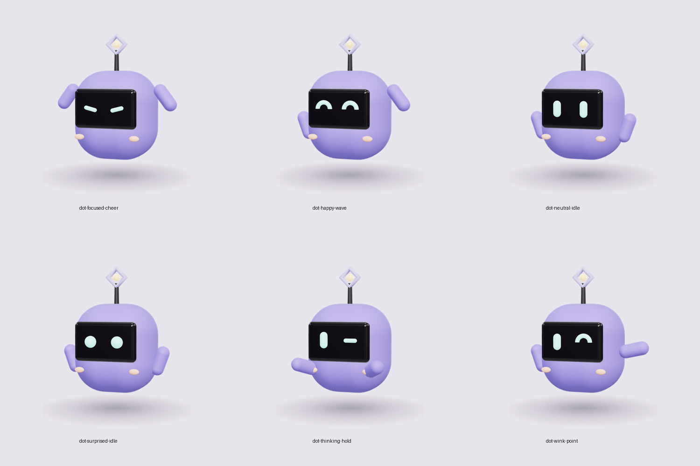

# Dot: the Build with Vish sidekick

An original character made for this brand. Built procedurally in `templates/three/kit.js` (`mascot()`), so every render is identical and on-palette. It is **not** based on, and must never be styled like, the Claude/Anthropic mascot or any existing brand character.

## Anatomy (fixed)
- Body: soft-clay rounded cube, brand violet #7F77DD, matte.
- Face: one glossy ink visor (#17141C). Eyes glow aurora teal (#6FE0D2). No mouth.
- Antenna: thin ink stem, topped by the **Build with Vish logo mark** (rotated-square ring) holding a warm sol (#F3C584) dot.
- Coral cheeks, two capsule arms, floats above a soft tinted contact shadow. No legs.

## Expressions → when to use
| Expression | Use for |
|---|---|
| neutral | default, explainers |
| happy (arcs) | CTA slide, wins, saves |
| wink | "here's the catch", insider tips |
| surprised (round eyes) | news, "this just changed" |
| thinking (one eye squint) | how-it-works, nuance |
| focused (slanted lines) | warnings, contracts, "do this now" |

Poses: idle, wave, point, cheer, hold. Combine any expression with any pose: `mascot({expression, pose})`.

## Rules
1. Max one Dot per slide, 150-200 px on a 1080 px slide, corner placement, never covering text.
2. Never change its colours, proportions, or add clothing, logos or text to it.
3. Never put Dot next to third-party logos as if endorsing them.
4. On dark slides keep the same violet; the glow does the separation.
5. New poses are added in code, rendered with `make mascot`, and added to this sheet.
